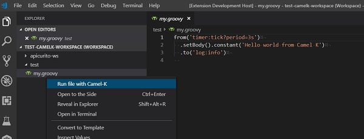

# Visual Studio extensions to support Camel-K

This project is a work-in-progress to explore what options we can add to VS Code to support Camel-K.

Note that it currently requires that Camel-K and Minikube be installed and available on the system path.

## Minikube + Camel-K in VS Code

The [Kubernetes Tools extension from Microsoft](https://marketplace.visualstudio.com/items?itemName=ms-kubernetes-tools.vscode-kubernetes-tools) offers a number of cool tools we can use with Minikube and Camel-K.

Once the Camel-K pods have started in Minikube, you can see them show up in the Kubernetes Activity view. This removes the need to explicitly get a list of pods in a terminal:


A cool feature of the Kubernetes view is when you right-click on a pod under the minikube node, you get a pop-up menu that allows you to "Follow Logs"...


...which opens the log for that pod in a new Terminal window.


Once your Camel-K/Minikube environment is running, you can do development on your route and run it using the 'Run file with Camel-K' menu this extension provides on the context menu when you right-click on a file in the Explorer. (Note currently this file only appears for Groovy files.)

With [Language Support for Apache Camel](https://marketplace.visualstudio.com/items?itemName=camel-tooling.vscode-apache-camel) installed, you also get LSP support for Camel XML and Java routes:


## 'Run file with Camel-K' menu

If Camel-K (Kamel) is in the system path, we can simply call the 'kamel' utility with appropriate options to run a particular file when the user wishes. For example, if I have a simple workspace with a Groovy file...



That launches my 'kamel' process (i.e. `kamel run --dev "complete/file/path"`) and I can see the output:


Current issues with this approach include:

* No way I can see to stop the process once it's running. I can start it, but I can't stop it with a second call.
* I noticed that file paths with spaces definitely do not work properly.

```bash
Command string: kamel run --dev "c:\Users\brianf\Documents\Visual Studio 2017\Workspaces\apicurito-ws\blah\my.groovy"
[OUT] integration "cusersbrianfdocumentsvisual-studio-2017workspacesapicurito-wsblahmy" updated
[OUT] integration "cusersbrianfdocumentsvisual-studio-2017workspacesapicurito-wsblahmy" in phase Deploying
```

It just hangs there. Long paths with NO spaces seems to work.

```bash
Command string: kamel run --dev "c:\test\my.groovy"
[OUT] integration "ctestmy" updated
[OUT] integration "ctestmy" in phase Running
[OUT] [1] Monitoring pod ctestmy-999565cbd-qkx6v[1] Starting the Java application using /opt/run-java/run-java.sh ...
[OUT] [1] exec java -XX:+UseParallelGC -XX:GCTimeRatio=4 -XX:AdaptiveSizePolicyWeight=90 -XX:MinHeapFreeRatio=20 -XX:MaxHeapFreeRatio=40 -XX:+ExitOnOutOfMemoryError -cp ./resources:/etc/camel/conf:/etc/camel/resources:/etc/camel/sources/i-source-000:dependencies/com.sun.xml.bind.jaxb-core-2.3.0.jar:dependencies/com.sun.xml.bind.jaxb-impl-2.3.0.jar:dependencies/commons-io.commons-io-2.6.jar:dependencies/org.apache.camel.camel-core-2.23.2.jar:dependencies/org.apache.camel.camel-groovy-2.23.2.jar:dependencies/org.apache.camel.k.camel-k-adapter-camel-2-0.3.2.jar:dependencies/org.apache.camel.k.camel-k-runtime-core-0.3.2.jar:dependencies/org.apache.camel.k.camel-k-runtime-groovy-0.3.2.jar:dependencies/org.apache.camel.k.camel-k-runtime-jvm-0.3.2.jar:dependencies/org.apache.commons.commons-lang3-3.8.1.jar:dependencies/org.apache.logging.log4j.log4j-api-2.11.2.jar:dependencies/org.apache.logging.log4j.log4j-core-2.11.2.jar:dependencies/org.apache.logging.log4j.log4j-slf4j-impl-2.11.2.jar:dependencies/org.codehaus.groovy.groovy-2.5.4.jar:dependencies/org.jooq.joor-java-8-0.9.10.jar:dependencies/org.slf4j.slf4j-api-1.7.25.jar org.apache.camel.k.jvm.Application
[1] OpenJDK 64-Bit Server VM warning: If the number of processors is expected to increase from one, then you should configure the number of parallel GC threads appropriately using -XX:ParallelGCThreads=N
[1] 2019-05-09 19:46:25.404 INFO  [main] ApplicationRuntime - Add listener: org.apache.camel.k.listener.ContextConfigurer@3f197a46
[1] 2019-05-09 19:46:25.407 INFO  [main] ApplicationRuntime - Add listener: org.apache.camel.k.listener.ContextLifecycleConfigurer@72f926e6
[1] 2019-05-09 19:46:25.408 INFO  [main] ApplicationRuntime - Add listener: org.apache.camel.k.listener.RoutesConfigurer@481a996b
[1] 2019-05-09 19:46:25.410 INFO  [main] ApplicationRuntime - Add listener: org.apache.camel.k.listener.RoutesDumper@28eaa59a
[1] 2019-05-09 19:46:25.650 INFO  [main] RoutesConfigurer - Loading routes from: file:/etc/camel/sources/i-source-000/c:\test\my.groovy?language=groovy
[1] 2019-05-09 19:46:26.240 INFO  [main] DefaultCamelContext - Apache Camel 2.23.2 (CamelContext: camel-k) is starting
[1] 2019-05-09 19:46:26.244 INFO  [main] ManagedManagementStrategy - JMX is enabled
[1] 2019-05-09 19:46:26.361 INFO  [main] DefaultTypeConverter - Type converters loaded (core: 195, classpath: 0)
[1] 2019-05-09 19:46:26.460 INFO  [main] DefaultCamelContext - StreamCaching is not in use. If using streams then its recommended to enable stream caching. See more details at http://camel.apache.org/stream-caching.html
[1] 2019-05-09 19:46:26.522 INFO  [main] DefaultCamelContext - Route: route1 started and consuming from: timer://tick?period=3s
[1] 2019-05-09 19:46:26.526 INFO  [main] DefaultCamelContext - Total 1 routes, of which 1 are started
[1] 2019-05-09 19:46:26.527 INFO  [main] DefaultCamelContext - Apache Camel 2.23.2 (CamelContext: camel-k) started in 0.286 seconds
[1] 2019-05-09 19:46:27.535 INFO  [Camel (camel-k) thread #2 - timer://tick] info - Exchange[ExchangePattern: InOnly, BodyType: String, Body: Hello world from Camel K]
```
