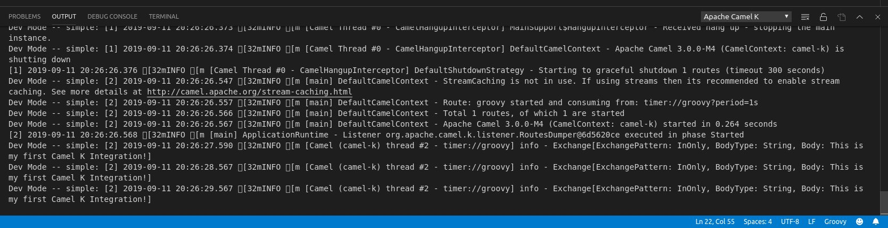

<h1 align="center">
  
   
  [Deprecated] Tooling for Apache Camel K
</h1>

  
  
  
  

 

> [!IMPORTANT]
> Deprecation Notice:
> 
> This VS Code extension is now deprecated. Several features of Camel K are now in Camel core. The corresponding tooling support will be migrated in various extension of the [VS Code Extension pack for Apache Camel](https://marketplace.visualstudio.com/items?itemName=redhat.apache-camel-extension-pack).

<h2 align="center">VS Code support for Apache Camel K functionality</h2>

  <a href="#features">Features</a> •
  <a href="#requirements">Requirements</a> •
  <a href="https://camel-tooling.github.io/vscode-camelk/">Documentation</a> •
  <a href="#issues">Issues</a>  •
  <a href="#data-and-telemetry">Telemetry</a>

<b>First, what is Apache Camel K?</b> According to its Github Readme, <i>“Apache Camel K is a lightweight integration platform, born on Kubernetes, with serverless superpowers.”</i> Essentially Camel K enables developers to run integrations on Kubernetes or OpenShift clusters which enables them to get Camel-based integration solutions up and running very quickly!

Our goal for the <b>Tooling for Apache Camel K</b> extension for <a href="https://code.visualstudio.com/">Microsoft Visual Studio Code</a> is to make that process even more seamless.

For more information about Camel K, be sure to check out its <a href="https://camel.apache.org/camel-k/latest/index.html">documentation</a> and <a href="https://github.com/apache/camel-K">github</a> pages.

 

### Features

- Start/Stop an Apache Camel K Integration
- Create a new Camel K Integration task configuration with multiple parameters
- Publish new Kubernetes ConfigMaps or Secrets
- View the status of published integrations
- View the log for an Apache Camel K Operator
- View the running log for a published Apache Camel K Integration
- Java Language Support
- Customize Apache Camel K Extension Settings
- Change the Namespace

### Requirements

- An **instance of Apache Camel K** running on a Kubernetes or an OpenShift cluster
- **Minikube** or the **Kubernetes CLI** installed. (more details at [Apache Camel K Installation](https://camel.apache.org/camel-k/latest/installation/installation.html) page)
- For some features, [JBang](https://www.jbang.dev/documentation/guide/latest/index.html) must be available on the system command-line.
- VS Code up to 1.85 is recommended. One test related to completion on Java standalone files with 1.86.x is failing but we have not found steps to reproduce manually, neither how to fix it so far.

### Documentation

Our full documentation is located in [GitHub pages](https://camel-tooling.github.io/vscode-camelk/). Included are details about all of Tooling for Apache Camel K extension capabilities with examples and detailed information.

### Issues

Something is not working properly? In that case, feel free to [open issues, add feature requests, report bugs, etc.](https://github.com/camel-tooling/vscode-camelk/issues)

### Get Involved

If you'd like to help us get better, we appriciate it!
Check out our [Contribution Guide](Contributing.md) on how to do that.

### Data and Telemetry

The Tooling for Apache Camel K extension collects anonymous [usage data](USAGE_DATA.md) and sends it to Red Hat servers to help improve our products and services. Read our [privacy statement](https://developers.redhat.com/article/tool-data-collection) to learn more. This extension respects the `redhat.elemetry.enabled` setting which you can learn more about at [How to disable Telemetry reporting](https://github.com/redhat-developer/vscode-redhat-telemetry#how-to-disable-telemetry-reporting).
