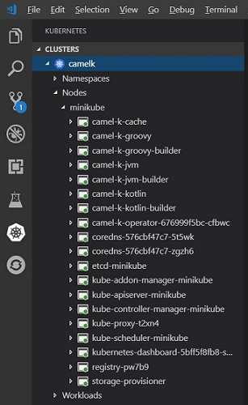
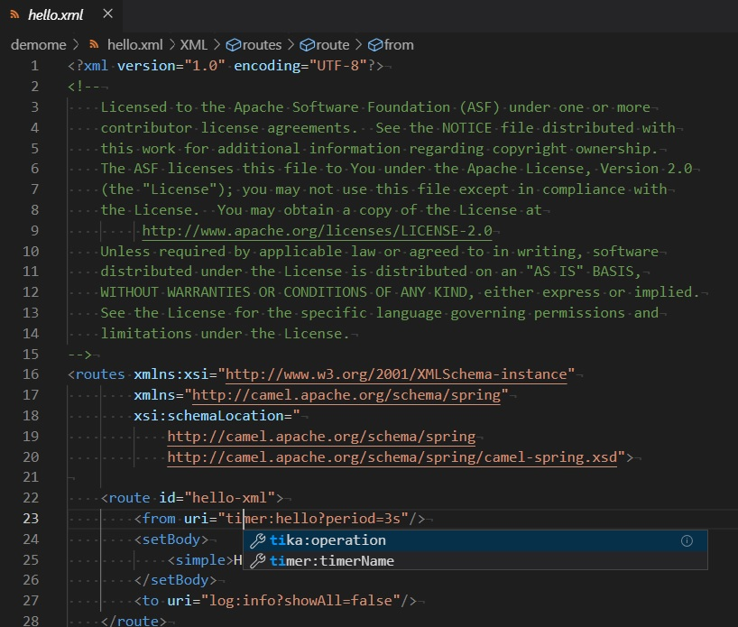
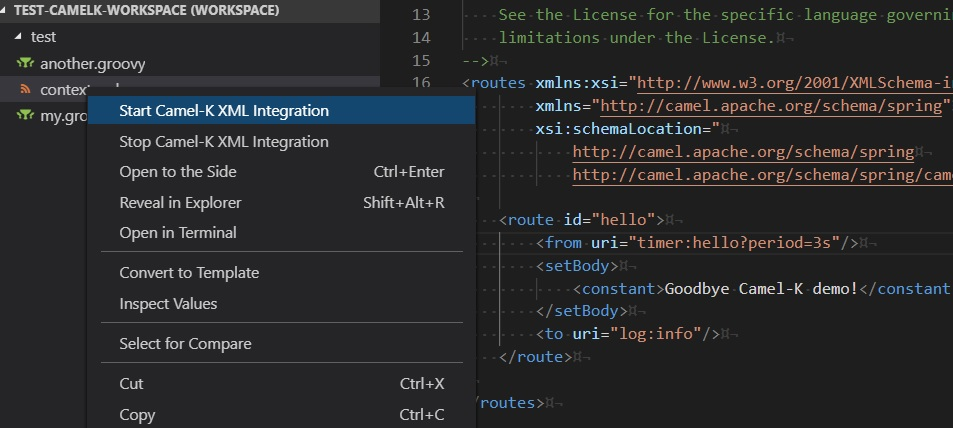

# Visual Studio extension to support Camel-K

This extension is a work-in-progress to explore what options we can add to VS Code to support Camel-K.

Note that it currently requires that both Camel-K and Minikube be installed and available on the system path.

To install Minikube and Camel-K, see [Installing MiniKube and Camel-K](configure-minikube-camelk.md).

## Kubernetes tools in VS Code

The [Kubernetes Tools extension from Microsoft](https://marketplace.visualstudio.com/items?itemName=ms-kubernetes-tools.vscode-kubernetes-tools) offers a number of tools we can use with Minikube and Camel-K. With a local Minikube instance running, you can see your local clusters appear in the Kubernetes Activity view.

With any node appearing in a Minikube cluster, you can easily follow the logs by right-clicking and selecting "Follow Logs" in the context menu.

This opens a log for that pod in a new Terminal window.

## Starting new Camel-K integrations

Once your Camel-K/Minikube environment is running and the vscode-camelk extension is installed, you can easily start a new Camel-K integration from a Java (*.java), Camel XML (Spring DSL) (*.xml), or Groovy (*.groovy) file. (JavaScript and Kotlin files may be supported in the future.) To do this, right-click on the Java, XML, or Groovy file, and select "Start Camel-K (Filetype) Integration."

| File Type | Menu Title |
| --------- | ---------- |
| XML (*.xml) | Start Camel-K XML Integration |
| Groovy (*.groovy) | Start Camel-K Groovy Integration |
| Java (*.java) | Start Camel-K Java Integration |

With [Language Support for Apache Camel](https://marketplace.visualstudio.com/items?itemName=camel-tooling.vscode-apache-camel) installed, you also get LSP support for Camel XML and Java routes:

LSP support is also coming for other file types (such as Groovy). And we will investigate adding run support for *.class files.

## 'Start Camel-K Integration' menu results

If Camel-K (Kamel) is in the system path, we can simply call the 'kamel' utility with appropriate options to run a particular file when the user wishes. For example, if I have a simple workspace with a Groovy file...

That launches my 'kamel' process from an XML file in the directory of the file (i.e. `kamel run --dev "filename"`) and I can see the output:

## Stopping running Camel-K integrations

In addition, there is a menu to stop a running integration. To do this, right-click on the Java, XML, or Groovy file, and select "Stop Camel-K (Filetype) Integration."

| File Type | Menu Title |
| --------- | ---------- |
| Java (*.java) | Stop Camel-K Java Integration |
| XML (*.xml) | Stop Camel-K XML Integration |
| Groovy (*.groovy) | Stop Camel-K Groovy Integration |

"Stop Camel-K Integration" essentially calls `kamel delete '${filename}'` to stop the running integration in the system.

## Camel-K Integrations view

The Camel-K Integrations view offers a list of the "integrations" registered with the current Camel-K context. If you right-click on a running integration, you can "Remove" an integration to stop them in the system.

The view has a "Refresh" button that can be used to manually trigger a refresh of the list, but when you add/remove file-based integrations in the Explorer view, it should refresh automatically.

## Known Issues

We know about the following issues...

### File name to integration name mapping

Running a camel class called "CamelRoute.java", deploys an integration called "camel-route". Though we can remove this integration via the Camel-K Integrations "remove" action, we cannot remove it via the right-click "Stop Integration" menu because we can't duplicate the naming scheme. Need to research how the "kamel" command names each integration and see if we can duplicate or reuse the logic. This affects any integration file with mixed case.

