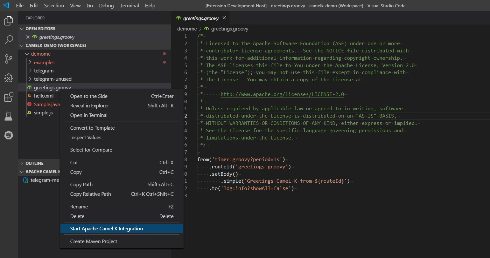

# Visual Studio extension to support Camel-K

This project is a work-in-progress to explore what options we can add to VS Code to support Camel-K.

Note that it currently requires that Camel-K and Minikube be installed and available on the system path.

To install Minikube and Camel-K, see [Installing MiniKube and Camel-K](configure-minikube-camelk.md).

## Kubernetes tools in VS Code

The [Kubernetes Tools extension from Microsoft](https://marketplace.visualstudio.com/items?itemName=ms-kubernetes-tools.vscode-kubernetes-tools) offers a number of tools we can use with Minikube and Camel-K. With a local Minikube instance running, you can see your local clusters appear in the Kubernetes Activity view.


With any node appearing in a Minikube cluster, you can easily follow the logs by right-clicking and selecting "Follow Logs" in the context menu.


This opens a log for that pod in a new Terminal window.


## Starting new Camel-K integrations

Once your Camel-K/Minikube environment is running and the vscode-camelk extension is installed, you can easily start a new Camel-K integration from a Java (*.java), Camel XML (Spring DSL) (*.xml), or Groovy (*.groovy) file. (JavaScript and Kotlin files may be supported in the future.) To do this, right-click on the Java, XML, or Groovy file, and select "Start Camel-K (Filetype) Integration."

| File Type | Menu Title |
| --------- | ---------- |
| XML (*.xml) | Start Camel-K XML Integration |
| Groovy (*.groovy) | Start Camel-K Groovy Integration |
| Java (*.java) | Start Camel-K Java Integration (currently has some issues) |

With [Language Support for Apache Camel](https://marketplace.visualstudio.com/items?itemName=camel-tooling.vscode-apache-camel) installed, you also get LSP support for Camel XML and Java routes:


LSP support is coming for other file types (such as Groovy) as well. And we will investigate adding run support for *.class files.

## 'Start Camel-K Integration' menu results

If Camel-K (Kamel) is in the system path, we can simply call the 'kamel' utility with appropriate options to run a particular file when the user wishes. For example, if I have a simple workspace with a Groovy file...



That launches my 'kamel' process from an XML file (i.e. `kamel run --dev "complete/file/path"`) -- you can also launch it for Groovy files -- and I can see the output:


## Stopping running Camel-K integrations

In addition, there is a menu to stop a running integration. To do this, right-click on the Java, XML, or Groovy file, and select "Stop Camel-K (Filetype) Integration."

| File Type | Menu Title |
| --------- | ---------- |
| Java (*.java) | Stop Camel-K Java Integration |
| XML (*.xml) | Stop Camel-K XML Integration |
| Groovy (*.groovy) | Stop Camel-K Groovy Integration |


"Stop Camel-K Integration" essentially calls `kamel delete '${filename}'` to stop the running integration in the system.

## Camel-K Integrations view

The Camel-K Integrations view offers a list of the "integrations" registered with the current Camel-K context.


The view has a "Refresh" button that can be used to manually trigger a refresh of the list, but when you add/remove file-based integrations in the Explorer view, it should refresh automatically.

Also, you can "Remove" integrations from this view to stop a running integration in the system.

## Known Issues

We know about the following issues.

### Files with Spaces in the File Path

When you try to run integration files for files with file paths with spaces, there are some problems.

```bash
Command string: kamel run --dev "c:\Users\brianf\Documents\Visual Studio 2017\Workspaces\apicurito-ws\blah\my.groovy"
[OUT] integration "cusersbrianfdocumentsvisual-studio-2017workspacesapicurito-wsblahmy" updated
[OUT] integration "cusersbrianfdocumentsvisual-studio-2017workspacesapicurito-wsblahmy" in phase Deploying
```

It just hangs there. 

However, long paths with NO spaces seems to work.

```bash
Command string: kamel run --dev "c:\test\my.groovy"
[OUT] integration "ctestmy" updated
[OUT] integration "ctestmy" in phase Running
[OUT] [1] Monitoring pod ctestmy-999565cbd-qkx6v[1] Starting the Java application using /opt/run-java/run-java.sh ...
[OUT] [1] exec java -XX:+UseParallelGC -XX:GCTimeRatio=4 -XX:AdaptiveSizePolicyWeight=90 -XX:MinHeapFreeRatio=20 -XX:MaxHeapFreeRatio=40 -XX:+ExitOnOutOfMemoryError -cp ./resources:/etc/camel/conf:/etc/camel/resources:/etc/camel/sources/i-source-000:dependencies/com.sun.xml.bind.jaxb-core-2.3.0.jar:dependencies/com.sun.xml.bind.jaxb-impl-2.3.0.jar:dependencies/commons-io.commons-io-2.6.jar:dependencies/org.apache.camel.camel-core-2.23.2.jar:dependencies/org.apache.camel.camel-groovy-2.23.2.jar:dependencies/org.apache.camel.k.camel-k-adapter-camel-2-0.3.2.jar:dependencies/org.apache.camel.k.camel-k-runtime-core-0.3.2.jar:dependencies/org.apache.camel.k.camel-k-runtime-groovy-0.3.2.jar:dependencies/org.apache.camel.k.camel-k-runtime-jvm-0.3.2.jar:dependencies/org.apache.commons.commons-lang3-3.8.1.jar:dependencies/org.apache.logging.log4j.log4j-api-2.11.2.jar:dependencies/org.apache.logging.log4j.log4j-core-2.11.2.jar:dependencies/org.apache.logging.log4j.log4j-slf4j-impl-2.11.2.jar:dependencies/org.codehaus.groovy.groovy-2.5.4.jar:dependencies/org.jooq.joor-java-8-0.9.10.jar:dependencies/org.slf4j.slf4j-api-1.7.25.jar org.apache.camel.k.jvm.Application
[1] OpenJDK 64-Bit Server VM warning: If the number of processors is expected to increase from one, then you should configure the number of parallel GC threads appropriately using -XX:ParallelGCThreads=N
[1] 2019-05-09 19:46:25.404 INFO  [main] ApplicationRuntime - Add listener: org.apache.camel.k.listener.ContextConfigurer@3f197a46
[1] 2019-05-09 19:46:25.407 INFO  [main] ApplicationRuntime - Add listener: org.apache.camel.k.listener.ContextLifecycleConfigurer@72f926e6
[1] 2019-05-09 19:46:25.408 INFO  [main] ApplicationRuntime - Add listener: org.apache.camel.k.listener.RoutesConfigurer@481a996b
[1] 2019-05-09 19:46:25.410 INFO  [main] ApplicationRuntime - Add listener: org.apache.camel.k.listener.RoutesDumper@28eaa59a
[1] 2019-05-09 19:46:25.650 INFO  [main] RoutesConfigurer - Loading routes from: file:/etc/camel/sources/i-source-000/c:\test\my.groovy?language=groovy
[1] 2019-05-09 19:46:26.240 INFO  [main] DefaultCamelContext - Apache Camel 2.23.2 (CamelContext: camel-k) is starting
[1] 2019-05-09 19:46:26.244 INFO  [main] ManagedManagementStrategy - JMX is enabled
[1] 2019-05-09 19:46:26.361 INFO  [main] DefaultTypeConverter - Type converters loaded (core: 195, classpath: 0)
[1] 2019-05-09 19:46:26.460 INFO  [main] DefaultCamelContext - StreamCaching is not in use. If using streams then its recommended to enable stream caching. See more details at http://camel.apache.org/stream-caching.html
[1] 2019-05-09 19:46:26.522 INFO  [main] DefaultCamelContext - Route: route1 started and consuming from: timer://tick?period=3s
[1] 2019-05-09 19:46:26.526 INFO  [main] DefaultCamelContext - Total 1 routes, of which 1 are started
[1] 2019-05-09 19:46:26.527 INFO  [main] DefaultCamelContext - Apache Camel 2.23.2 (CamelContext: camel-k) started in 0.286 seconds
[1] 2019-05-09 19:46:27.535 INFO  [Camel (camel-k) thread #2 - timer://tick] info - Exchange[ExchangePattern: InOnly, BodyType: String, Body: Hello world from Camel K]
```

### Java file issues

Running a camel class called "CamelRoute.java", it seems to get stuck in the "Building Context" phase. I'm guessing this is due to the filename and the somehow injected dash.

```bash
integration "ccamelkprojectsrcmainjavacomprojectroutescamel-route" created
integration "ccamelkprojectsrcmainjavacomprojectroutescamel-route" in phase Building Context
```

Also, having a file in a deeper folder structure seems to run into some fun issues.

```bash
integration "ccamelkprojectsample" created
 
integration "ccamelkprojectsample" in phase Building Context
 
integration "ccamelkprojectsample" in phase Deploying
 
integration "ccamelkprojectsample" in phase Running
 
[1] Monitoring pod ccamelkprojectsample-84f77d44f-khdmz[1] Starting the Java application using /opt/run-java/run-java.sh ...
 
[1] exec java -XX:+UseParallelGC -XX:GCTimeRatio=4 -XX:AdaptiveSizePolicyWeight=90 -XX:MinHeapFreeRatio=20 -XX:MaxHeapFreeRatio=40 -XX:+ExitOnOutOfMemoryError -cp ./resources:/etc/camel/conf:/etc/camel/resources:/etc/camel/sources/i-source-000:dependencies/com.sun.xml.bind.jaxb-core-2.3.0.jar:dependencies/com.sun.xml.bind.jaxb-impl-2.3.0.jar:dependencies/commons-io.commons-io-2.6.jar:dependencies/org.apache.camel.camel-core-2.23.2.jar:dependencies/org.apache.camel.k.camel-k-adapter-camel-2-0.3.2.jar:dependencies/org.apache.camel.k.camel-k-runtime-core-0.3.2.jar:dependencies/org.apache.camel.k.camel-k-runtime-jvm-0.3.2.jar:dependencies/org.apache.commons.commons-lang3-3.8.1.jar:dependencies/org.apache.logging.log4j.log4j-api-2.11.2.jar:dependencies/org.apache.logging.log4j.log4j-core-2.11.2.jar:dependencies/org.apache.logging.log4j.log4j-slf4j-impl-2.11.2.jar:dependencies/org.jooq.joor-java-8-0.9.10.jar:dependencies/org.slf4j.slf4j-api-1.7.25.jar org.apache.camel.k.jvm.Application
[1] OpenJDK 64-Bit Server VM warning: If the number of processors is expected to increase from one, then you should configure the number of parallel GC threads appropriately using -XX:ParallelGCThreads=N
[1] 2019-05-14 19:58:40.210 INFO  [main] ApplicationRuntime - Add listener: org.apache.camel.k.listener.ContextConfigurer@6a400542
 
[1] 2019-05-14 19:58:40.213 INFO  [main] ApplicationRuntime - Add listener: org.apache.camel.k.listener.ContextLifecycleConfigurer@636be97c
[1] 2019-05-14 19:58:40.214 INFO  [main] ApplicationRuntime - Add listener: org.apache.camel.k.listener.RoutesConfigurer@31368b99
[1] 2019-05-14 19:58:40.214 INFO  [main] ApplicationRuntime - Add listener: org.apache.camel.k.listener.RoutesDumper@4ac3c60d
[1] 2019-05-14 19:58:40.247 INFO  [main] RoutesConfigurer - Loading routes from: file:/etc/camel/sources/i-source-000/c:\camelkproject\Sample.java?language=java
[1] 2019-05-14 19:58:40.307 INFO  [main] DefaultCamelContext - Apache Camel 2.23.2 (CamelContext: camel-k) is shutting down
[1] 2019-05-14 19:58:40.311 INFO  [main] MainLifecycleStrategy - CamelContext: camel-k has been shutdown, triggering shutdown of the JVM.
[1] 2019-05-14 19:58:40.317 INFO  [main] DefaultCamelContext - Apache Camel 2.23.2 (CamelContext: camel-k) uptime 
[1] 2019-05-14 19:58:40.318 INFO  [main] DefaultCamelContext - Apache Camel 2.23.2 (CamelContext: camel-k) is shutdown in 0.010 seconds
[1] Exception in thread "main" org.apache.camel.RuntimeCamelException: org.joor.ReflectException: Error while compiling c:\camelkproject\Sample
[1] 	at org.apache.camel.util.ObjectHelper.wrapRuntimeCamelException(ObjectHelper.java:1826)
[1] 	at org.apache.camel.k.adapter.Exceptions.wrapRuntimeCamelException(Exceptions.java:27)
[1] 	at org.apache.camel.k.listener.RoutesConfigurer.load(RoutesConfigurer.java:75)
[1] 	at org.apache.camel.k.listener.RoutesConfigurer.accept(RoutesConfigurer.java:45)
[1] 	at org.apache.camel.k.listener.AbstractPhaseListener.accept(AbstractPhaseListener.java:31)
[1] 	at org.apache.camel.k.jvm.ApplicationRuntime$MainListenerAdapter.lambda$configure$2(ApplicationRuntime.java:113)
[1] 	at java.lang.Iterable.forEach(Iterable.java:75)
[1] 	at org.apache.camel.k.jvm.ApplicationRuntime$MainListenerAdapter.configure(ApplicationRuntime.java:113)
[1] 	at org.apache.camel.main.MainSupport.postProcessCamelContext(MainSupport.java:618)
[1] 	at org.apache.camel.main.MainSupport.postProcessContext(MainSupport.java:550)
[1] 	at org.apache.camel.k.adapter.Main.doStart(Main.java:46)
[1] 	at org.apache.camel.support.ServiceSupport.start(ServiceSupport.java:72)
[1] 	at org.apache.camel.main.MainSupport.run(MainSupport.java:170)
[1] 	at org.apache.camel.k.jvm.ApplicationRuntime.run(ApplicationRuntime.java:66)
[1] 	at org.apache.camel.k.jvm.Application.main(Application.java:52)
[1] Caused by: org.joor.ReflectException: Error while compiling c:\camelkproject\Sample
[1] 	at org.joor.Compile.compile(Compile.java:153)
[1] 	at org.joor.Reflect.compile(Reflect.java:102)
[1] 	at org.joor.Reflect.compile(Reflect.java:77)
[1] 	at org.apache.camel.k.jvm.loader.JavaSourceLoader$1.configure(JavaSourceLoader.java:57)
[1] 	at org.apache.camel.builder.RouteBuilder.checkInitialized(RouteBuilder.java:463)
[1] 	at org.apache.camel.builder.RouteBuilder.configureRoutes(RouteBuilder.java:403)
[1] 	at org.apache.camel.builder.RouteBuilder.addRoutesToCamelContext(RouteBuilder.java:384)
[1] 	at org.apache.camel.impl.DefaultCamelContext$3.call(DefaultCamelContext.java:1024)
[1] 	at org.apache.camel.impl.DefaultCamelContext$3.call(DefaultCamelContext.java:1021)
[1] 	at org.apache.camel.impl.DefaultCamelContext.doWithDefinedClassLoader(DefaultCamelContext.java:3267)
[1] 	at org.apache.camel.impl.DefaultCamelContext.addRoutes(DefaultCamelContext.java:1021)
[1] 	at org.apache.camel.k.listener.RoutesConfigurer.load(RoutesConfigurer.java:73)
[1] 	... 12 more
[1] Caused by: java.lang.IllegalArgumentException: Illegal character in path at index 12: string:///c:\camelkproject\Sample.java
[1] 	at java.net.URI.create(URI.java:852)
[1] 	at org.joor.Compile$CharSequenceJavaFileObject.<init>(Compile.java:250)
[1] 	at org.joor.Compile.compile(Compile.java:67)
[1] 	... 23 more
[1] Caused by: java.net.URISyntaxException: Illegal character in path at index 12: string:///c:\camelkproject\Sample.java
[1] 	at java.net.URI$Parser.fail(URI.java:2848)
[1] 	at java.net.URI$Parser.checkChars(URI.java:3021)
[1] 	at java.net.URI$Parser.parseHierarchical(URI.java:3105)
[1] 	at java.net.URI$Parser.parse(URI.java:3053)
[1] 	at java.net.URI.<init>(URI.java:588)
[1] 	at java.net.URI.create(URI.java:850)
[1] 	... 25 more
[1] 2019-05-14 19:58:40.323 INFO  [Camel Thread #1 - CamelHangupInterceptor] MainSupport$HangupInterceptor - Received hang up - stopping the main instance.
 
```
