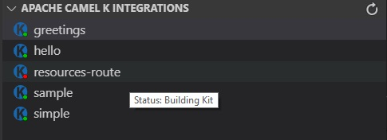

# Visual Studio extension to support Camel-K

This extension offers basic integration with Camel-K (https://github.com/apache/camel-k) on two fronts.

First, Camel-K runs with a combination of the "kamel" runtime and either Minishift, Minikube, or GKE running locally on the development system. We utilize the "kamel" and "kubectl" executables to manage a few basic tasks listed further down.

Second, we also have the capability of using Restful calls to a Proxy when provided the correct URL and port combination (defaulting to http://localhost:8000). The proxy offers the same functionality as if we were using the command-line executables.

To install Minikube and Camel-K, see [Installing MiniKube and Camel-K](configure-minikube-camelk.md).

## Kubernetes tools in VS Code

The [Kubernetes Tools extension from Microsoft](https://marketplace.visualstudio.com/items?itemName=ms-kubernetes-tools.vscode-kubernetes-tools) offers a number of tools we can use with Minikube and Camel-K. With a local Minikube instance running, you can see your local clusters appear in the Kubernetes Activity view.

With any node appearing in a Minikube cluster, you can easily follow the logs by right-clicking and selecting "Follow Logs" in the context menu.

This opens a log for that pod in a new Terminal window.

## Starting new Camel-K integrations

Once your Camel-K/Minikube environment is running and the vscode-camelk extension is installed, you can easily start a new Camel-K integration from a Java (*.java), Camel XML (Spring DSL) (*.xml), JavaScript (*.js) or Groovy (*.groovy) file. (Kotlin files may be supported in the future.) To do this, right-click on the Java, XML, JavaScript, or Groovy file, and select "Start Camel-K Integration."

With [Language Support for Apache Camel](https://marketplace.visualstudio.com/items?itemName=camel-tooling.vscode-apache-camel) installed, you also get LSP support for Camel XML and Java routes:

LSP support is also coming for other file types (such as Groovy). And we will investigate adding run support for *.class files.

## 'Start Camel-K Integration' menu results

If Camel-K (Kamel) is in the system path, we can simply call the 'kamel' utility with appropriate options to run a particular file when the user wishes. For example, if I have a simple workspace with a Groovy file...

That launches my 'kamel' process from an XML file in the directory of the file (i.e. `kamel run "filename"` or the equivalent Kubernetes rest call) or uses the Kubernetes Rest API to deploy the integration to the running Kubernetes system.

There are two types of "output channels" providing details for the extension.

* The "Camel-K" output channel (View->Output, select "Camel-K" from the drop-down in the view) offers details about events such as when the Camel-K Integrations view is refreshed, when new integrations are started, when running integrations are stopped, and when the log of a particular running integration is viewed.
* In that last case, the "Follow log for Camel-K Integration" menu, when invoked on a running integration in the Camel-K Integrations view, opens a new Output channel named for the running "pod" associated with that particular integration. This gives you access to the running Camel log for the selected integration.

## Stopping running Camel-K integrations

Once an integration is running, it may be stopped in the "Camel-K Integrations" view by right-clicking on the integration and selecting "Remove Camel-K Integration." Stopping an integration removes its associated output channel.

"Stop Camel-K Integration" essentially calls `kamel delete '${filename}'` (or the equivalent call in the Kubernetes Rest API) to stop the running integration in the system.

## Camel-K Integrations view

The Camel-K Integrations view offers a list of the "integrations" registered with the current Camel-K context. If you right-click on a running integration, you can "Remove" an integration to stop them in the system or "Follow" the log to show the running log for your integration in a new Output channel.

Following a log opens a new Output channel named for the running Kubernetes pod where the integration is running. It updates as new data is added to it:

In addition, the view has a "Refresh" button that can be used to manually trigger a refresh of the list, but when you add/remove file-based integrations in the Explorer view, it should refresh automatically.

Note: Refreshing the view sometimes is delayed as we wait for pods to start. You may need to give it a few seconds. If nothing happens, the Refresh button is a good option.

Integrations in the list are decorated with a little dot indicating the status of the deployment. If green, the integration is in a "Running" state. If red, it is in other states such as "Building Kit" or "Error." And if you hover over the integration, the tooltip will show the status.

### Camel-K Status Bar Messages

While events are occurring such as the Camel-K Integrations view is being refreshed or a new Integration is being deployed, a status bar message will appear to offer an indication. This can be disabled in the extension settings.

The extension shows status messages when:

* Starting a new integration
* Removing an integration
* Refreshing the integrations view
* Starting to follow an integration log
* Starting a local Kubernetes proxy instance

## Camel-K Extension Settings

To access the new extension settings, go to File->Preferences->Settings, then select "Extensions" and finally "Camel-K Integration Settings."

* Proxy Namespace - Currently this drop-down has two values: default and syndesis.
* Proxy Port - Corresponds to the port of the Proxy URL to be used for accessing Kubernetes via Rest APIs. Defaults to 8000.
* Proxy URL - This setting corresponds to the server proxy url for your Kubernetes service. It defaults to http://localhost, but can be altered to any appropriate service URL. It is combined with the port to construct URLs at runtime when starting the proxy and using proxy calls. (See [Use an HTTP Proxy to Access the Kubernetes API)[https://kubernetes.io/docs/tasks/access-kubernetes-api/http-proxy-access-api/] for details on how to create the local proxy (i.e. 'kubectl proxy –port=8000') and "Starting a local Kubernetes proxy" below.)
* Show Status Bar Messages - Indicates whether to show messages in the status bar to indicate when the system is updating, such as when the Camel-K Integrations view is being refreshed or a new Integration is being deployed.
* Use Proxy - This setting determines whether the Camel-K Integrations view retrieves the list of running integrations via the local 'kubectl' application or via the Kubernetes Rest API and calls through the Proxy URL/Namespace combination above. The ultimate URL becomes [proxyurl]/apis/camel.apache.org/v1alpha1/namespaces/[namespace]/integrations. 

## Starting a local Kubernetes proxy

(Only available with the Minikube executable installed, but useful for local development.)

We have created a new command available in the command palette (Ctrl+Shift+P or F1) called "Camel-K: Start the kubectl proxy server." This will start a new Kubernetes proxy using the Minikube executable ('kubectl proxy --port=8000) and refreshes the Camel-K Integrations view immediately. This command creates a local proxy at the URL composed of the Proxy URL and Proxy Port set in the settings. For example, with the defaults the proxy URL becomes http://localhost:8000.

## Known Issues

Here's the current list of issues we're working to resolve. If you find a new issue, please [create a new issue report in GitHub](https://github.com/camel-tooling/vscode-camelk/issues)!
