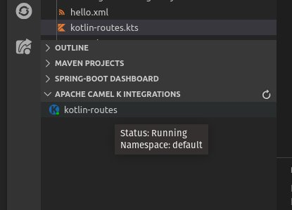

[]()
[](https://circleci.com/gh/camel-tooling/vscode-camelk)
[]()
[](https://camel.zulipchat.com/#narrow/stream/258729-camel-tooling)

# Visual Studio extension to support Apache Camel K

First, what is Apache Camel K? According to its Github Readme, “Apache Camel K is a lightweight integration platform, born on Kubernetes, with serverless superpowers.” Essentially Camel K enables developers to run integrations on Kubernetes or OpenShift clusters which enables them to get Camel-based integration solutions up and running very quickly! 

Our goal for the **Tooling for Apache Camel K** extension for Microsoft Visual Studio Code (VS Code) is to make that process even more seamless. 

For more information about Camel K, be sure to check out its [documentation](https://camel.apache.org/camel-k/latest/index.html) and [github](https://github.com/apache/camel-K) pages.

## Before you begin

In order to use our **Tooling for Apache Camel K** extension for VS Code, you must have the following software in place:

* An instance of Apache Camel K running on a Kubernetes or an OpenShift cluster that is  accessible from your system on your network. You must also have Minikube (or the Kubernetes CLI) installed. See the Apache Camel K installation page for details: (https://camel.apache.org/camel-k/latest/installation/installation.html). 
* Microsoft VS Code installed. You can get the most recent version from (https://code.visualstudio.com/) for your chosen operating system.
* To benefit from Java Language completion on standalone files, [VS Code Language support for java](https://marketplace.visualstudio.com/items?itemName=redhat.java) needs to be installed.
* To benefit from Java debug on standalone files, [VS Code Debugger for Java](https://marketplace.visualstudio.com/items?itemName=vscjava.vscode-java-debug) needs to be installed.

## Installing the extension

The **Tooling for Apache Camel K** extension is available in the VS Code Extension Marketplace (https://marketplace.visualstudio.com/items?itemName=redhat.vscode-camelk). 

### Steps

1. Open your VS Code Integrated Development Environment (IDE).
2. In the VS Code Activity Bar, select Extensions. (Alternately, press Ctrl+Shift+X).
3. In the search bar, type **Apache Camel K** 


4. In the **Tooling for Apache Camel K** box, click **Install**.
5. In addition, we encourage you to also install these VS Code extensions:

    * Kubernetes Tools extension from Microsoft - This extension offers a number of supplemental tools you can use with Minikube and Apache Camel K to check pod status and more. It is available here (https://marketplace.visualstudio.com/items?itemName=ms-kubernetes-tools.vscode-kubernetes-tools).
    * Language Support for Apache Camel (https://marketplace.visualstudio.com/items?itemName=camel-tooling.vscode-apache-camel) - This extension provides auto-completion for Camel components, attributes, and the list of attribute values in the Camel URI for integrations written in XML, Java, Groovy, JavaScript, and Kotlin.

    You can install them by following the same steps except search for Kubernetes or Apache Camel in the list of extensions.

## Get started using Didact tutorial

A tutorial to get started is available when [VS Code Didact](https://marketplace.visualstudio.com/items?itemName=redhat.vscode-didact) is installed. It is accessible through the `Didact Tutorials` view:


The tutorial is providing a detailed step-by-step description and is integrated in VS Code. When finished, you can continue to look to this readme which contains broader scope information.

## Creating a new Camel K Integration file

1. From command palette, choose `Create a new Apache Camel K Integration file`
2. Choose the language to use.
3. Choose the workspace folder
4. Provide a name for the new file

The new Apache Camel K Integration file is created at the root of the chosen workspace folder.

## Starting a new Camel K Integration

After your Apache Camel K/Minikube environment is running and you have installed the **Tooling for Apache Camel K** (vscode-camelk) extension, you can start a new Apache Camel K integration.

You can start a new Camel K integration with or without additional options such as ConfigMaps or Secrets. (For information about how to publish a ConfigMap or Secret, see [Publishing new Kubernetes ConfigMaps or Secrets](#publishing-new-kubernetes-configmaps-or-secrets)).

1. In the VS Code Explorer, right-click on an integration file that is one of the following file types:

* Java (*.java)
* Camel plain XML DSL (not Spring XML or Blueprint) (*.xml)
* JavaScript (*.js)
* Groovy (*.groovy)
* Kotlin (*.kts)
* Yaml (*.yaml)

    For more information about supported languages, see [Languages](https://camel.apache.org/camel-k/latest/languages/languages.html) in the Apache Camel-K documentation.
	
    Note: `Start` CodeLens can also be used at the top of the editor of opened Camel K files.

2. In the popup menu, select **Start Apache Camel K Integration**. 

    

    A drop-down appears in the command palette with several choices:

    

* **Dev Mode - Apache Camel K Integration in Dev Mode**

    In “Dev Mode,” all output is directed to the Apache Camel K output channel, including startup tasks. In addition, when you update the integration file, the integration is re-deployed automatically for easier development and debugging. For more information about Dev Mode, see [Running in Dev Mode](https://camel.apache.org/camel-k/latest/running/dev-mode.html) in the Apache Camel-K documentation.

* **Basic - Apache Camel K Integration**

    The "Basic" option starts the file as a new integration to deploy the integration to the running Kubernetes system.

* **ConfigMap - Apache Camel K Integration with Kubernetes ConfigMap as Runtime Configuration**

    Select a ConfigMap from a list of the published ConfigMaps in your current Kubernetes system. For example:

    

* **Secret - Apache Camel K Integration with Kubernetes Secret as Runtime Configuration**

    Select a Secret from a list of the published Secrets in your current Kubernetes system. For more information about configuration with ConfigMaps or Secrets, see [Configuration via ConfigMap or Secret](https://camel.apache.org/camel-k/latest/configuration/configmap-secret.html) in the Apache Camel K documentation.

* **Resource - Apache Camel K Integration with Resource file**

    Select one or more resource files from the file selection dialog.

* **Property - Apache Camel K Integration with Property**

    Specify property name/property value pairs, with the option to specify more than one. For more information about configuration with properties, see [Configure Integrations](https://camel.apache.org/camel-k/latest/configuration/configuration.html) in the Apache Camel-K documentation.

* **Dependencies - Apache Camel K Integration with Explicit Dependencies**

    Specify dependency details either by their camel-component artifact Id or by their Maven coordinates (group:artifact:version), with the option to specify more than one. For more information about configuration with Dependencies, see [Dependencies and Component Resolution](https://camel.apache.org/camel-k/latest/configuration/dependencies.html) in the Apache Camel K documentation.

* **Define a Task for Easily Reproducible Multi-attribute Deployment**

    Some types of deployments require more complex combinations of attributes. In these cases, defining a custom Task of type "camel-k" is useful. To create a task, see section[Creating a new Camel K Integration with multiple parameters](#Creating-a-new-Camel-K-Integration-with-multiple-parameters) 

When you start a new integration, the extension starts the deployment process with the *kamel run [filename]* command and any options after that.

**Note:** The first time that you publish a new integration, the extension might take a few moments to propagate through the system to a running state. 

To update the state of your currently deployed integrations, hover over the **Apache Camel K Integrations** view and click the **Refresh** button.


## Creating a new Camel K Integration task configuration with multiple parameters

Though the simple "Start Apache Camel K Integration" menu works well for simple cases, you can use a Task for more complex integrations. When the Camel K integration requires more configuration, you can set that up using a Task.

To create a new Task, you have a few options.

1. From command palette, call the `Tasks: Configure Task` command. This will open the tasks.json file where you can enter new task info by hand (with some auto-completion support in the editor). If you already have a tasks.json but no Camel K tasks, you can create a new task with type `camel-k` in the tasks.json which is automatically opened.
2. If you don't have any Tasks configured yet, you can use the `camel-k: Start in dev mode Camel K integration opened in active editor` command, which will template an initial Camel K task for you.

You will end up with something like the following with a new, empty Camel K task specified:

```
{
    // See https://go.microsoft.com/fwlink/?LinkId=733558 
    // for the documentation about the tasks.json format
    "version": "2.0.0",
    "tasks": [
        {
            "type": "camel-k",
            "dev": true,
            "file": "${file}",
            "problemMatcher": []
        }
    ]
}
```

Note: We recommend adding a `label` attribute to more easily find your task in the task list when you try to run it.

Once you've created your Camel K task, you can use auto-complete to explore the various parameters available. The following example launches the integration in `--dev` mode and provides a couple of dependencies:

```
{
    "type": "camel-k",
    "label": "Run RestWithUndertow and Dependencies",
    "dev": true,
    "file": "./examples/RestWithUndertow.java",
    "problemMatcher": [],
    "dependencies": [ "camel-rest", "camel-undertow" ]
}
```

When you've defined your Task, you can use one of two options to execute it:
- call command from palette `Tasks: Run Task`. You will see the command listed with the label that you provided previously.
- with the `Start Apache Camel Integration` command, pick the option `Use a predefined Task - useful for multi-attributes deployment`

After running the camel-k `Task`, a terminal will open where you can see the command used and any execution result.

## Publishing new Kubernetes ConfigMaps or Secrets

You can use the **Tooling for Apache Camel K** extension to create ConfigMaps and Secrets and publish them to the running Kubernetes system.

###Before you begin

You must have a *.properties file that you want to use as the basis for the ConfigMap or Secret. Properties files consist of name/value pairs. Each property can then be referenced in a route by the property name to use the value by reference.

For example, you might have an *application.properties* file that has two entries:

    my.message=Hello World
    logging.level.org.apache.camel=DEBUG

In your route, you can then refer to *my.message* by providing as **{{my.message}}**. 

In a Groovy route, that might look like **from('timer:props?period=1s').log('{{my.message}}')**.

### Steps

1. In the VS Code Explorer view, right-click on the *.properties file.
2. Select one of the following options:
    * Create Kubernetes Config Map from File
    * Create Kubernetes Secret from File

3. Type the name of your new ConfigMap or Secret. The name must start with a letter and contain no spaces. You can use numbers or hyphens. For example, **my-config-map** is a valid name but **my config map** is not. 


4. Press **Enter**. The extension creates a new ConfigMap or Secret that you can reference in your Apache Camel K route.

For more information about configuration with ConfigMaps or Secrets, see [Configuration via ConfigMap or Secret](https://camel.apache.org/camel-k/latest/configuration/configmap-secret.html) in the Apache Camel-K documentation for more details.

## Viewing the status of published integrations

After you publish a new integration, it appears in the **Apache Camel K Integrations** view in the Side Bar of the Explorer activity:


When you add or remove file-based integrations in the Explorer view, it automatically refreshes the list.

**Note:** Refreshing the view sometimes is delayed as pods start. You might need to wait a few seconds. Optionally, to manually refresh the list, click the **Refresh** button.


The status of deployment for Integrations is indicated by the color of the dot in the K icon for the integration. If green, the integration is in a "Running" state. If red, it is in another state, such as "Building Kit" or "Error". Hover over the integration to view a tooltip that shows the status:


The **Tooling for Apache Camel K** extension shows a status bar message for the following events:

* Starting a new integration
* Removing an integration
* Refreshing the integrations view
* Starting to follow an integration log
* Starting a local Kubernetes proxy instance

Optionally, to disable status bar messages:

1. From the VS Code IDE, select **File->Preferences->Settings**.
2. Select **Extensions** and then select **Apache Camel K Tooling Extension Settings**.
3. Uncheck the **Show Status Bar Messages** option.

## Viewing the log for a Apache Camel K Operator

In the background of each Apache Camel K system, there is an Operator coordinating the various builders and integrations being spun up. This log will often contain information not found in the integration log, including kit builder details. (See [Viewing the running log](#viewing-the-running-log-for-a-published-apache-camel-k-integration) below for details on opening the integration log.)


A new view opens. It is named for the running Kubernetes pod where the Operator is running. This log updates as new data is added.

## Viewing the running log for a published Apache Camel K Integration

If you are running an integration in Dev mode, you can view the logged output for that integration in the **Apache Camel K Output channel**.

If you want to explicitly view the running log for a published integration in a new Log view, right-click on a running integration and then select the **Follow log for running Apache Camel K Integration** option.


A new view opens. It is named for the running Kubernetes pod where the integration is running. This log updates as new data is added:


Note: By default, `Auto-scroll` is checked and new entries in the log will automatically be scrolled to at the bottom of the window. If turned off, the scrolling stops and can be done manually.

## Stopping an Apache Camel K integration

1. From the **Apache Camel K Integrations** view, right-click the integration that you want to stop.
2. Select **Remove Apache Camel K Integration**.

## Java language support

To benefit from Java Language completion on standalone files, [VS Code Language support for java](https://marketplace.visualstudio.com/items?itemName=redhat.java) needs to be installed. An invisible project is created with a default classpath.

The command `Refresh local Java classpath for Camel K standalone file based on current editor. Available with kamel 1.4+.` refreshes specific dependencies for the classpath of the opened Integration, such as dependencies declared as part of the modeline of the file. When using a modeline to configure such dependencies, you gain a [CodeLens](https://code.visualstudio.com/blogs/2017/02/12/code-lens-roundup) link (`Refresh classpath dependencies`) at the top of the editor to trigger the refresh more easily.

Be aware of the following limitations:
  - It requires Camel K 1.4.0
  - If mistakenly called with Camel K 1.3.2-, need to restart VS Code for basic dependencies to be available again.
  - It supports modeline dependencies notation from local build. See [apache/camel-k#2213](https://github.com/apache/camel-k/issues/2213)
  - A single classpath is provided. It means that refresh command needs to be called when switching between Integration file written in Java that does not have the same dependencies.
  - There is no progress indicator. Please be patient. The first time may take several minutes on a slow network.
  
To benefit from Java debug on standalone files, [VS Code Debugger for Java](https://marketplace.visualstudio.com/items?itemName=vscjava.vscode-java-debug) needs to be installed. To leverage it, you need to start an integration, then there are 2 solutions:
- Right-click on integration in Integrations view, then choose `Start Java debugger on Camel K integration`.
- Launch a `camel-k-debug` VS Code tasks and then to launch a `java` attach in debug VS Code tasks.

## Apache Camel K Extension Settings

To access **Tooling for Apache Camel K** extension settings:

1. From the VS Code IDE, select **File->Preferences->Settings**.
2. Select Extensions and then select **Apache Camel K Tooling Extension Settings**.


Settings include:

* **Close Log View When Integration Removed** - Indicates whether an open Log view for a published integration should be closed if the integration is removed (stopped). Defaults to true (checked). If unchecked, the Log will remain open and indicate that the integration has been stopped in the title bar.
* **Show Status Bar Messages** - Indicates whether to show messages in the status bar to indicate when the system is updating, such as when the Camel K Integrations view is being refreshed or a new Integration is being deployed.
* **Namespace** - The namespace to be used for all Apache Camel K and Kubernetes operations. This defaults to `default` but can be set to whatever your namespace has been configured to in your runtime. When it is updated, the Apache Camel K Integrations view is refreshed automatically. (See [Changing the Namespace](#changing-the-namespace) below for a bit more detail.)

## Your First Integration

After your Apache Camel K/Minikube environment is running and you have installed the **Tooling for Apache Camel K** (vscode-camelk) extension, you can quickly start your first integration.

1. Create a directory on your development system called **integrations**. For example, */home/(User_Name)/Documents/integrations* on Linux or *C:\Users\(User_Name)\Documents\integrations* on Windows.
2. Download the simple.groovy file (https://github.com/apache/camel-k/blob/master/examples/simple.groovy) into your new **integrations** directory.
3. Start a new workspace in your VS Code Integrated Development Environment (IDE).
4. Add the folder from step 1 to your new workspace with **File->Add Folder to Workspace...**
5. Right-click on **simple.groovy** in your directory and select **Start Apache Camel K Integration**. 
6. Select **Dev Mode - Apache Camel K Integration in Dev Mode**.
7. Watch as messages appear in the **Apache Camel K Output channel** as your integration begins to run.
8. Open **simple.groovy** and update the message to say ‘This is my first Camel K Integration!’. Save the file with **File->Save** or **Ctrl+S**.
9. Watch as your integration is updated and your new message begins to appear in the output channel. 


## Changing the Namespace

Updating the Namespace setting (see [Apache Camel K Extension Settings](#apache-camel-k-extension-settings)) changes the default namespace that the Apache Camel K and Kubernetes CLIs use when referencing the running system. By default, the namespace is set to the system default when the field is blank, but depending on your system you may change it to some other namespace. 

When you hover over a published integration and the namespace setting is set, you can now see what namespace is being used to populate the Apache Camel K Integrations view.



And if there are no published integrations available, you may see a message in the Apache Camel K output channel such as "`Refreshing Apache Camel K Integrations view succeeded, no published integrations available for namespace mynamespace.`" 

If any change is made to the namespace setting, the view will refresh accordingly.

## Known Issues

Here's the current list of issues we're working to resolve. If you find a new issue, please [create a new issue report in GitHub](https://github.com/camel-tooling/vscode-camelk/issues)!

## Data and telemetry

The Project Initializer by Red Hat for Visual Studio Code collects anonymous [usage data](USAGE_DATA.md) and sends it to Red Hat servers to help improve our products and services. Read our [privacy statement](https://developers.redhat.com/article/tool-data-collection) to learn more. This extension respects the `redhat.elemetry.enabled` setting which you can learn more about at https://github.com/redhat-developer/vscode-commons#how-to-disable-telemetry-reporting
