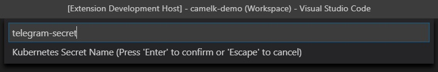

## Publishing new Kubernetes ConfigMaps or Secrets

You can use the **Tooling for Apache Camel K** extension to create ConfigMaps and Secrets and publish them to the running Kubernetes system.

### Before you begin

You must have a `*.properties` file that you want to use as the basis for the ConfigMap or Secret. Properties files consist of name/value pairs. Each property can then be referenced in a route by the property name to use the value by reference.

For example, you might have an `application.properties` file that has two entries:

```properties
my.message=Hello World
logging.level.org.apache.camel=DEBUG
```

In your route, you can then refer to **my.message** by providing as `{{my.message}}`.

In a Groovy route, that might look like `from('timer:props?period=1s').log('{{my.message}}')`.

### Steps

1. In the VS Code Explorer view, right-click on the `*.properties` file.
2. Select one of the following options:
    - `Create Kubernetes Config Map from File`
    - `Create Kubernetes Secret from File`

3. Type the name of your new ConfigMap or Secret. The name must start with a letter and contain no spaces. You can use numbers or hyphens.
    - For example, **my-config-map** is a valid name but **my config map** is not.
    <p align="center"></p>

4. Press **Enter**. The extension creates a new ConfigMap or Secret that you can reference in your Apache Camel K route.

For more information about configuration with ConfigMaps or Secrets, see [Configuration via ConfigMap or Secret](https://camel.apache.org/camel-k/next/configuration/runtime-config.html) in the Apache Camel K documentation for more details.
