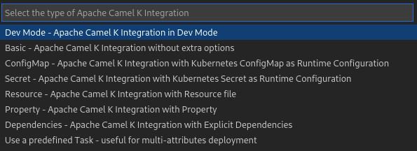
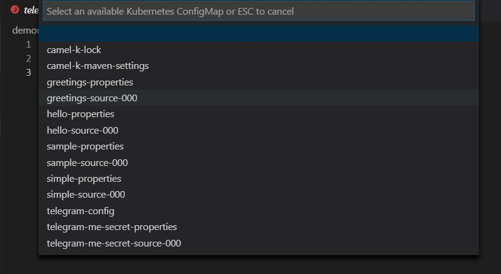
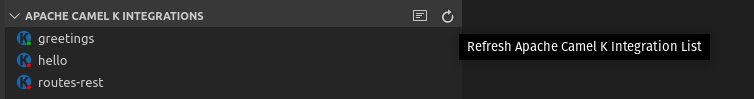

## Creating a new Camel K Integration file

1. From the command palette, choose `Camel: Create a Camel route using XXX DSL`
2. Provide a name for the new file

The new Apache Camel K Integration file is created at the root of the workspace folder.

## Stopping an Apache Camel K integration

1. From the **Apache Camel K Integrations** view, right-click the integration that you want to stop.
2. Select **Remove Apache Camel K Integration**.

## Starting a new Camel K Integration

After your Apache Camel K/Minikube environment is running and you have installed the **Tooling for Apache Camel K** (vscode-camelk) extension, you can start a new Apache Camel K integration.

You can start a new Camel K integration with or without additional options such as ConfigMaps or Secrets. (For information about how to publish a ConfigMap or Secret, see [Publishing new Kubernetes ConfigMaps or Secrets](../content/configmaps-secrets.md)).

1. In the VS Code Explorer, right-click on an integration file that is one of the following file types:
    - **Java** (*.java)
    - **Camel** plain **XML DSL** (not Spring XML or Blueprint) (*.xml)
    - **JavaScript** (*.js)
    - **Groovy** (*.groovy)
    - **Kotlin** (*.kts)
    - **Yaml** (*.yaml and *.yml)

    For more information about supported languages, see [Languages](https://camel.apache.org/camel-k/latest/languages/languages.html) in the Apache Camel K documentation.
    **Note**: `Start` CodeLens can also be used at the top of the editor of opened Camel K files.

2. In the popup menu, select **Deploy Integration with Apache Camel K**.
    A drop-down appears in the command palette with several choices:
    

    - **Dev Mode - Apache Camel K Integration in Dev Mode**
      In “Dev Mode,” all output is directed to the Apache Camel K output channel, including startup tasks. In addition, when you update the integration file, the integration is re-deployed automatically for easier development and debugging. For more information about Dev Mode, see [Running in Dev Mode](https://camel.apache.org/camel-k/latest/running/dev-mode.html) in the Apache Camel K documentation.

    - **Basic - Apache Camel K Integration**
      The "Basic" option starts the file as a new integration to deploy the integration to the running Kubernetes system.

    - **ConfigMap - Apache Camel K Integration with Kubernetes ConfigMap as Runtime Configuration**
      Select a ConfigMap from a list of the published ConfigMaps in your current Kubernetes system. For example:
      

    - **Secret - Apache Camel K Integration with Kubernetes Secret as Runtime Configuration**
      Select a Secret from a list of the published Secrets in your current Kubernetes system. For more information about configuration with ConfigMaps or Secrets, see [Configuration via ConfigMap or Secret](https://camel.apache.org/camel-k/next/configuration/runtime-config.html) in the Apache Camel K documentation.

    - **Resource - Apache Camel K Integration with Resource file**
      Select one or more resource files from the file selection dialog.

    - **Property - Apache Camel K Integration with Property**
      Specify property name/property value pairs, with the option to specify more than one. For more information about configuration with properties, see [Configure Integrations](https://camel.apache.org/camel-k/latest/configuration/configuration.html) in the Apache Camel K documentation.

    - **Dependencies - Apache Camel K Integration with Explicit Dependencies**
      Specify dependency details either by their camel-component artifact Id or by their Maven coordinates (group:artifact:version), with the option to specify more than one. For more information about configuration with Dependencies, see [Dependencies and Component Resolution](https://camel.apache.org/camel-k/latest/configuration/dependencies.html) in the Apache Camel K documentation.

    - **Define a Task for Easily Reproducible Multi-attribute Deployment**
      Some types of deployments require more complex combinations of attributes. In these cases, defining a custom Task of type "camel-k" is useful. To create a task, see the section [Creating a new Camel K Integration with multiple parameters](../content/multiple-parameters.md)

When you start a new integration, the extension starts the deployment process with the `kamel run [filename]` command and any options after that.

**Note:** The first time that you publish a new integration, the extension might take a few moments to propagate through the system to a running state.

To update the state of your currently deployed integrations, hover over the `Apache Camel K Integrations** view` and click the `Refresh` button.

