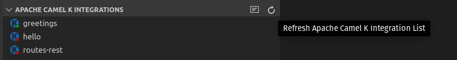

## Viewing the status of published integrations

After you publish a new integration, it appears in the **Apache Camel K Integrations** view in the Side Bar of the Explorer activity:

When you add or remove file-based integrations in the Explorer view, it automatically refreshes the list.
**Note:** Refreshing the view sometimes is delayed as pods start. You might need to wait a few seconds. Optionally, to manually refresh the list, click the **Refresh** button.

The status of deployment for Integrations is indicated by the color of the dot in the K icon for the integration. If green, the integration is in a "Running" state. If red, it is in another state, such as "Building Kit" or "Error". Hover over the integration to view a tooltip that shows the status:

The **Tooling for Apache Camel K** extension shows a status bar message for the following events:

- Starting a new integration
- Removing an integration
- Refreshing the integrations view
- Starting to follow an integration log
- Starting a local Kubernetes proxy instance

Optionally, to disable status bar messages:

1. From the VS Code IDE, select **File > Preferences > Settings**.
2. Select **Extensions** and then select **Apache Camel K Tooling Extension Settings**.
3. Uncheck the **Show Status Bar Messages** option.

## Viewing the log for an Apache Camel K Operator

In the background of each Apache Camel K system, there is an Operator coordinating the various builders and integrations being spun up. This log will often contain information not found in the integration log, including kit builder details. (See [Viewing the running log](#viewing-the-running-log-for-a-published-apache-camel-k-integration) below for details on opening the integration log.)

A new editor view opens. It is named for the running Kubernetes pod where the Operator is running. This log updates as new data is added.

## Viewing the running log for a published Apache Camel K Integration

If you are running an integration in Dev mode, you can view the logged output for that integration in the **Apache Camel K Output channel**.

If you want to explicitly view the running log for a published integration in a new Log view, right-click on a running integration and then select the **Follow log for running Apache Camel K Integration** option.

A new editor view opens. It is named for the running Kubernetes pod where the integration is running. This log updates as new data is added:

**Note**: By default, `Auto-scroll` is checked and new entries in the log will automatically be scrolled to the bottom of the window. If turned off, the scrolling stops and can be done manually.
