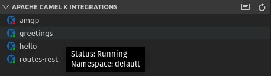

## Changing the Namespace

Updating the Namespace setting (see [Apache Camel K Extension Settings](../content/settings.md)) changes the default namespace that the Apache Camel K and Kubernetes CLIs use when referencing the running system. By default, the namespace is set to the system default when the field is blank, but depending on your system you may change it to some other namespace.

When you hover over a published integration and the namespace setting is set, you can now see what namespace is being used to populate the Apache Camel K Integrations view.

And if there are no published integrations available, you may see a message in the Apache Camel K output channel such as `Refreshing Apache Camel K Integrations view succeeded, no published integrations available for namespace mynamespace.`

If any change is made to the namespace setting, the view will automatically refresh accordingly.
