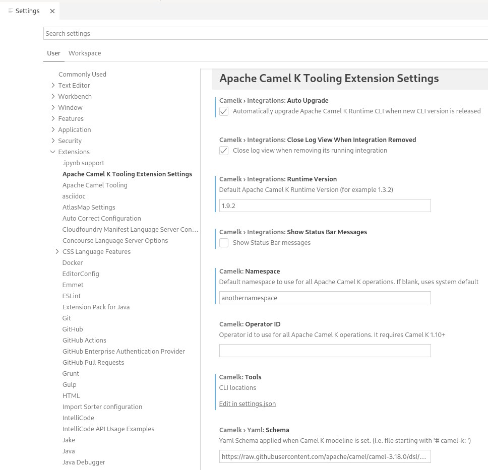

## Apache Camel K Extension Settings

To access **Tooling for Apache Camel K** extension settings:

1. From the VS Code IDE, select **File > Preferences > Settings**.
2. Select Extensions and then select **Apache Camel K Tooling Extension Settings**.

Extension settings include:

- **Close Log View When Integration Removed** - Indicates whether an open Log view for a published integration should be closed if the integration is removed (stopped). Defaults to true (checked). If unchecked, the Log will remain open and indicate that the integration has been stopped in the title bar.
- **Show Status Bar Messages** - Indicates whether to show messages in the status bar to indicate when the system is updating, such as when the Camel K Integrations view is being refreshed or a new Integration is being deployed.
- **Namespace** - The namespace to be used for all Apache Camel K and Kubernetes operations. This defaults to `default` but can be set to whatever your namespace has been configured to in your runtime. When it is updated, the Apache Camel K Integrations view is refreshed automatically. (See [Changing the Namespace](../content/namespaces.md) below for a bit more detail.)
- **Operator id** - Camel K can be installed with different operator id allowing multi-tenancies and mixing versions of Camel K on the same cluster. The operator id can be specified in this case with this setting. If provided, all operations using `kamel` CLI underneath will use it.
